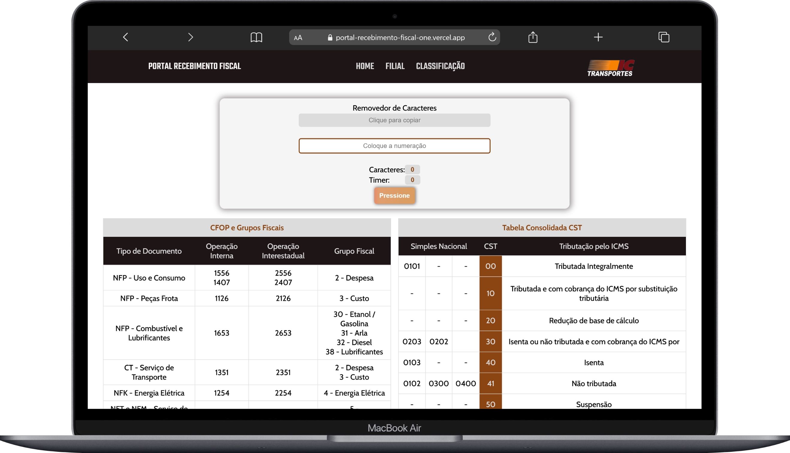

# 🧾 Portal Interno de Consultas Tributárias

Aplicação web desenvolvida para centralizar consultas fiscais que anteriormente estavam distribuídas em múltiplas planilhas internas.

---

## 📌 Contexto

No setor fiscal, as consultas tributárias eram realizadas manualmente em diferentes planilhas, o que tornava o processo mais lento e sujeito a erros.

O objetivo do projeto foi criar uma interface simples e funcional para centralizar essas informações e facilitar o fluxo operacional da equipe.

---

## 🎯 Objetivo

- Centralizar consultas tributárias em um único ambiente
- Reduzir retrabalho
- Minimizar erros operacionais
- Facilitar o acesso às informações internas

---

## 🛠️ Tecnologias Utilizadas

- HTML5
- CSS3
- JavaScript
- Manipulação de DOM
- Tratamento de strings

---

## 🚀 Funcionalidades

- Interface web simples e intuitiva
- Consulta centralizada de informações fiscais
- Utilitário para remoção automática de caracteres em:
  - Linhas digitáveis de boletos
  - Chaves de acesso de NF-e
- Facilitação de cópia e inserção de dados em sistemas internos

---

## 📚 Aprendizados

- Manipulação de elementos via JavaScript
- Tratamento e transformação de strings
- Organização de layout voltado para uso interno
- Desenvolvimento orientado a problema real

---

## 🔒 Observação

Este projeto foi desenvolvido para uso interno e não contém dados sensíveis no repositório público.

